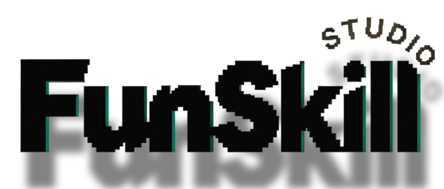

  

# FunSkill Studio Connector

把你的 AI 助手接到 **FunSkill 工作室**：一句话找到技能、买断使用、在对话里直接产出成果。

官网：**https://funskill.cn**

[English](#english) | [简体中文](#简体中文)

---

## 简体中文

### 这是什么

一个 **MCP 连接器技能**（Agent Skills 开放标准）。安装后，你的 AI 助手（豆包 / WorkBuddy / Cursor / Claude / Codex / CodeBuddy 等）学会调用 FunSkill：浏览市场、引导注册购买、安装与执行已购技能。

**本包只含调度规则，不含任何技能内容**——技能内容由 FunSkill 服务端在授权后下发。

### 三步接入

1. **安装本技能**：手动把本目录复制进你的 AI 客户端 skills 目录（各客户端路径见 [`references/clients.md`](references/clients.md)）
2. **拿令牌**：对 AI 说「打开 FunSkill 连接器接入页」，或登录 `funskill.cn` → 账户中心 → 连接器接入 → 生成 `fsk_` 令牌
3. **配置 MCP**：地址 `https://funskill.cn/mcp` + 令牌，分步教程见 [`references/clients.md`](references/clients.md)

配好后对 AI 说：「有哪些 FunSkill 技能」。

### 付费模型

FunSkill 是**买断制，两层授权**：

- **入场资格**：购买过任意一款有效技能（赠品不计）后，才解锁技能执行服务与开源生态技能的搜索/调用资格；零购买时，任何付费技能都无法使用，也不能搜索或调用开源生态技能
- **逐款授权**：付费技能按款单独付费、单独授权——购买技能 A 仅可调用 A，不能调用未购买的 B、C；调用未拥有款返回 NOT_PURCHASED 并附该款购买链接
- 逛市场（`list_market`）与打开页面（`open_app`）匿名可用

### 安全

技能内容服务端逐文件授权下发（不整包暴露）、带隐形水印可溯源；开源社区技能请先自检再使用。

### 协议

MIT — 见 `LICENSE`。**本项目不接受外部拉取请求（Pull Request）**；如有问题请在 Issues 反馈。技能内容本身不在 MIT 范围内，由 FunSkill 服务端授权后逐文件下发。

---

## English

### What is this

An **MCP connector skill** (Agent Skills open standard). Once installed, your AI assistant (Doubao / WorkBuddy / Cursor / Claude / Codex / CodeBuddy, etc.) learns to use FunSkill: browse the marketplace, get guided through sign-up and purchase, install and run purchased skills.

**This package contains routing rules only — no skill content.** Content is delivered by the FunSkill server after authorization.

### Three steps

1. **Install**: manually copy this directory into your AI client's skills folder (per-client paths in [`references/clients.md`](references/clients.md))
2. **Get a token**: tell your AI "open the FunSkill connector page", or sign in at `funskill.cn` → Account Center → Connector Access → generate an `fsk_` token
3. **Configure MCP**: endpoint `https://funskill.cn/mcp` + your token — step-by-step guides in [`references/clients.md`](references/clients.md)

Then say: "What FunSkill skills are there?"

### Pricing model

Buyout, two layers:

1. **Entry**: owning at least one valid paid skill (gifts excluded) unlocks skill execution and open-source ecosystem search/use; with zero purchases, no paid skill and no ecosystem access work.
2. **Per-title**: each paid skill is licensed separately — buying A unlocks A only, not B or C; calling an unowned title returns NOT_PURCHASED with that title's buy link.

Browsing the marketplace (`list_market`) and opening pages (`open_app`) work anonymously.

### Security

Skill content is served file-by-file after authorization (never as a whole package) and carries invisible watermarks for traceability. Self-review open-source community skills before use.

### License

MIT — see `LICENSE`. **External pull requests are not accepted**; please open an issue for questions. Skill content itself is not covered by MIT and is delivered by the FunSkill server after authorization.
